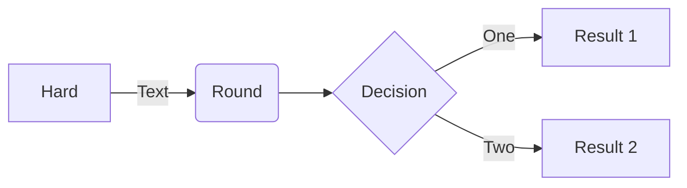
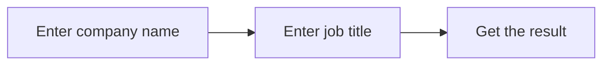
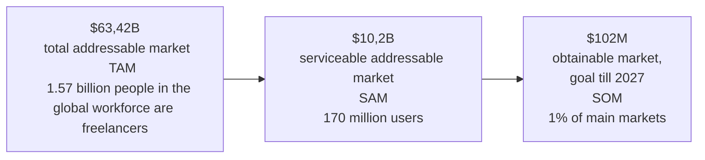

---
title:
- Osint Bot Presentation
author:
- CEO | Yuriy Galych
- Copenhagen
---

# What's the problem? Our people may be working for the enemy without even realizing it 2

- Is the company I am going to work for connected to the aggressor country?
- Is it a reliable company?
- Is it worth getting involved with?
- Will I have problems because I work or worked for this company?
- Etc.

# AI-based Telegram bot that checks employer using OSINT methods 3

Green text

- Find job postings of your employer on .ru and .by websites
- Analyze employer connections with the aggressor country using OSINT methods

# It takes just 3 simple steps to get started: 4

- Advanced verification is available when entering password

# Makret size urkainians and friends of Ukraine 5

# How do we make money? 6
The bot will be in 2 versions: free and by subscription $10/month
Pictures are negotiable

# Competition 7

The picture shows that we have all the green pluses, and our competitors have all the minuses. 

# Go-to-market strategy 8

Lick one on one

# Our team 9
Lick one to one, replace the photos with your own and change the text.

# Money raising 10 
To lick off the sample

# OSINT bot invites investors to join us for peace in Ukraine and Europe 11

Cut from the sample. Rework for yourself

  graph TD;
      A-->B;
      A-->C;
      B-->D;
      C-->D;

